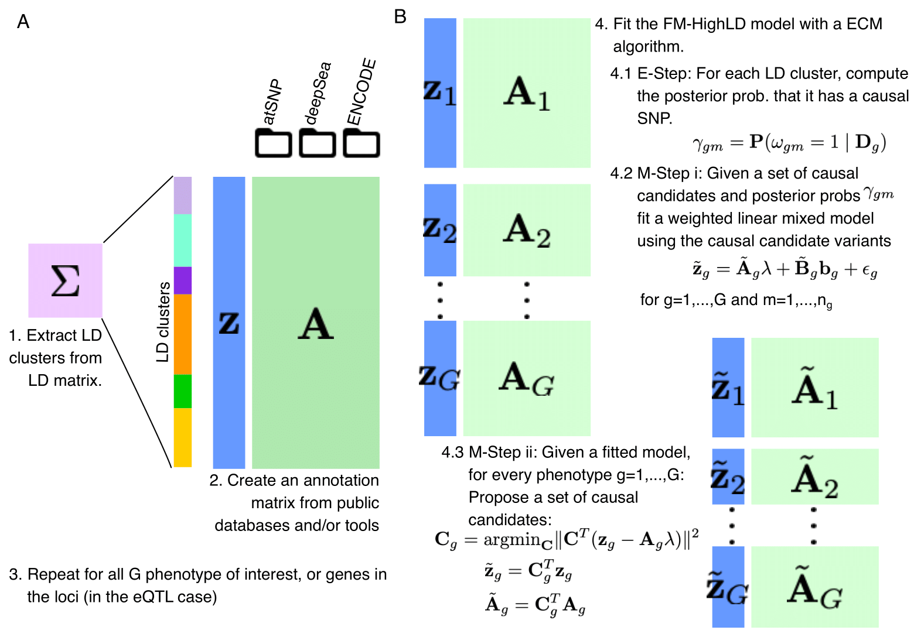

# FMHighLD: A package for fine-mapping multiple-phenotype GWAS / eQTL studies by the use of association statistics and annotation data

The goal of `FMHighLD` is to determine the causal variants of a GWAS experiment by using:

- Association statistics
- Annotation data
- Pre-defined LD clusters

Then, `FMHighLD` will iterate two steps until finding convergence:

1. Fit a linear (mixed) model of the association statistics as a function of the annotation data
2. Find a set of causal candidates based on the linear (mixed) model



## Installation

You can install the development version from
[GitHub](https://github.com/) with:

``` r
# install.packages("devtools")
devtools::install_github("welch16/FMHighLD", ref = "devel")
```
